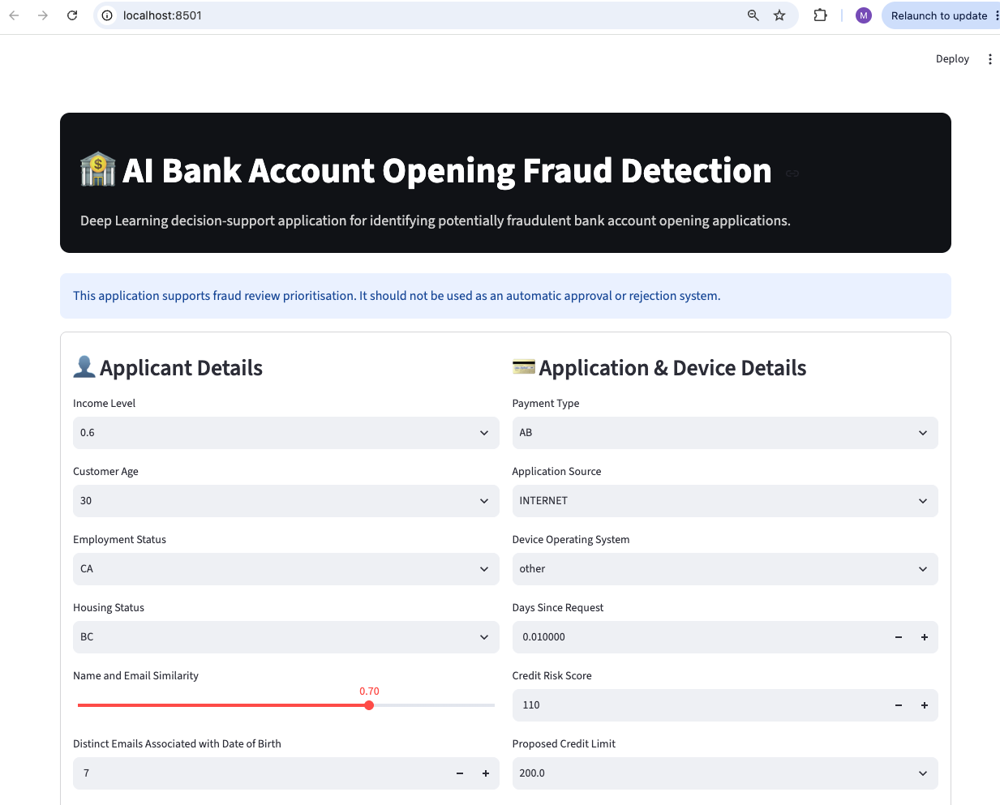
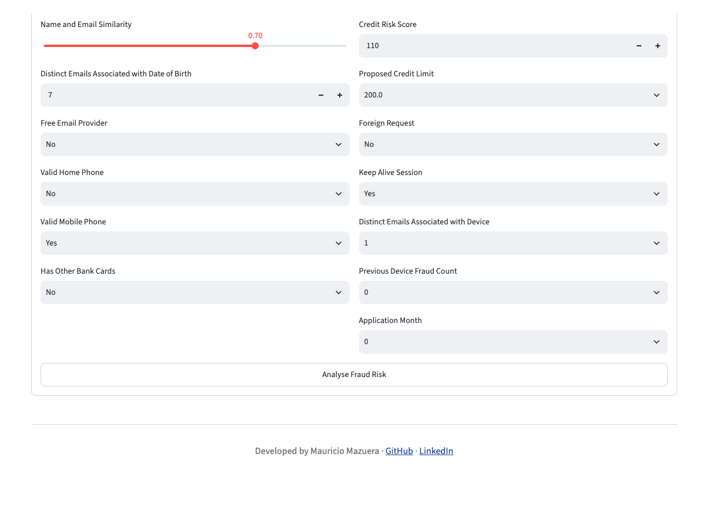
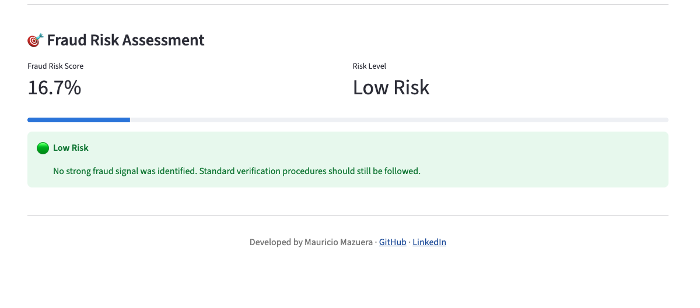

# 🏦 AI Bank Account Opening Fraud Detection

Deep Learning application for detecting potentially fraudulent bank account opening applications using customer profile, device information and application behaviour.

The project was developed following an end-to-end Machine Learning workflow, from data preparation to deployment with Streamlit and Docker.

---

## Project Overview

Financial institutions receive thousands of online account opening applications every day.

Although most applications are legitimate, a small proportion correspond to synthetic identities, identity theft or organised fraud.

The objective of this project is to develop a Deep Learning model capable of estimating the fraud risk of a new application, allowing fraud analysts to prioritise manual investigations.

The application is intended as a **decision-support system**, not as an automatic approval or rejection tool.

---

## Business Problem

Manual fraud investigations are expensive and time consuming.

An accurate risk scoring model can help financial institutions:

- Reduce operational costs
- Prioritise suspicious applications
- Improve fraud detection efficiency
- Reduce customer friction
- Support fraud analysts during decision making

---

## Dataset

**Dataset**

Bank Account Fraud (NeurIPS 2022)

Source:

https://www.kaggle.com/datasets/sgpjesus/bank-account-fraud-dataset-neurips-2022

Characteristics

- 1,000,000 observations
- 31 predictive variables
- Binary classification
- Approximately 1.1% fraudulent applications
- Public research dataset

---





## Technologies

- Python
- Pandas
- NumPy
- Scikit-Learn
- TensorFlow / Keras
- Streamlit
- Docker
- Git
- GitHub

---

## Project Structure

```
AI-Bank-Account-Opening-Fraud-Detection/

│

├── app/
│   ├── constants.py
│   ├── utils.py
│   └── streamlit.py
│
├── notebooks/
│   ├── 01_data_preparation.ipynb
│   ├── 02_model_development.ipynb
│   └── 03_model_evaluation.ipynb
│
├── data/
│   ├── raw/
│   └── processed/
│
├── models/
│
├── images/
│
├── Dockerfile
├── requirements.txt
├── README.md
└── .gitignore
```

---

# Project Workflow

The project follows a simplified CRISP-DM methodology.

## 1. Data Preparation

- Data loading
- Exploratory analysis
- Missing value inspection
- Duplicate analysis
- Feature encoding
- Feature scaling
- Train/Test split

---

## 2. Model Development

The following models were developed:

- Logistic Regression
- Random Forest
- Decision Tree
- XGBoost
- Deep Neural Network (TensorFlow)

A Scikit-Learn Pipeline was used for all traditional machine learning models.

---

## 3. Model Evaluation

The models were evaluated using:

- Accuracy
- Precision
- Recall
- F1-score
- ROC AUC
- PR AUC
- Confusion Matrix

---

## Model Comparison

| Model | Accuracy | Recall | Precision |
|--------|----------|----------|------------|
| Logistic Regression | 0.785 | 0.760 | 0.038 |
| Random Forest | 0.989 | 0.014 | 0.250 |
| Decision Tree | 0.978 | 0.070 | 0.063 |
| XGBoost | 0.989 | 0.034 | 0.455 |
| Deep Neural Network | 0.778 | **0.794** | 0.038 |

---

## Why was the Deep Neural Network selected?

Although the Deep Neural Network achieved the lowest overall accuracy, it obtained the highest Recall.

For fraud detection, failing to identify fraudulent applications (False Negatives) is generally considered more costly than investigating additional legitimate applications (False Positives).

For this reason, the Deep Neural Network was selected as the final production model.

---

# Streamlit Application

The deployed application allows fraud analysts to evaluate a new bank account application by entering customer and application information.

The model returns:

- Fraud Risk Score
- Risk Level
- Operational Recommendation

---

# Docker

Build

```bash
docker build -t bank-account-fraud-detection .
```

Run

```bash
docker run -p 8501:8501 bank-account-fraud-detection
```

---

# Installation

Clone repository

```bash
git clone https://github.com/hmmazuera/AI-Bank-Account-Opening-Fraud-Detection.git
```

Create virtual environment

```bash
python -m venv venv
```

Activate environment

Windows

```bash
venv\Scripts\activate
```

Mac/Linux

```bash
source venv/bin/activate
```

Install dependencies

```bash
pip install -r requirements.txt
```

Run Streamlit

```bash
streamlit run app/streamlit_app.py
```

---

# Results

The final Deep Learning model provides a practical decision-support tool capable of prioritising suspicious bank account opening applications.

The application is designed to support fraud analysts rather than replacing human decision-making.

---

# Future Improvements

- Hyperparameter optimisation
- Cost-sensitive learning
- Threshold optimisation
- Explainability using SHAP
- FastAPI REST API
- Cloud deployment (AWS / Azure)
- CI/CD pipeline

---

# Author

Mauricio Mazuera

GitHub: https://github.com/hmmazuera/AI-Bank-Account-Opening-Fraud-Detection

LinkedIn: https://www.linkedin.com/in/mauricio-mazuera-a0a7a933b